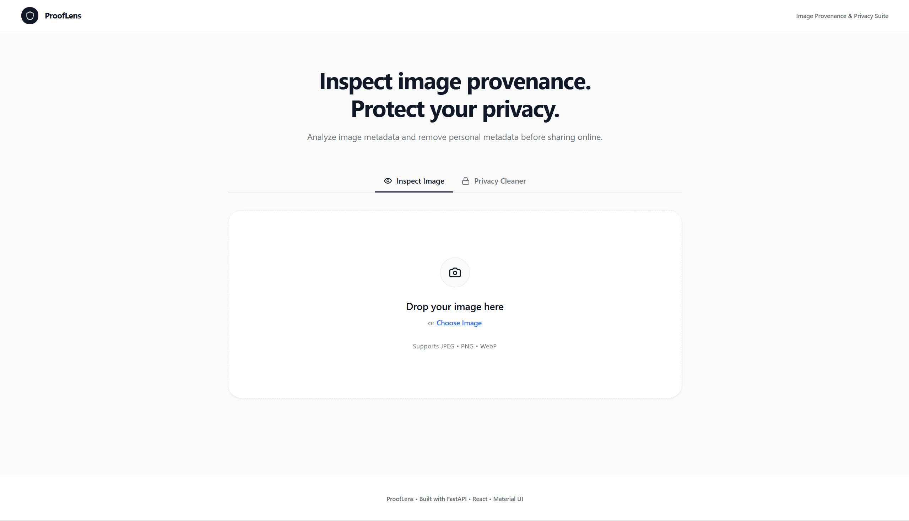

# ProofLens

[](https://python.org)
[](https://fastapi.tiangolo.com)
[](https://react.dev)
[](https://vite.dev)
[](https://mui.com)
[](LICENSE)
[](https://prooflens-tool.vercel.app)
[](https://prooflens-api-nbfl.onrender.com)

**Image Provenance & Privacy Toolkit**

ProofLens inspects the metadata embedded inside digital images — EXIF, IPTC, XMP, PNG text chunks, and C2PA Content Credentials — and presents the findings in a clean, readable report. It also includes a privacy cleaner that strips personal metadata from images before you share them online.

> **What is image provenance?**
> Every time you take a photo, your device quietly saves information inside the image file — your GPS location, camera model, date, time, and sometimes even the software used to edit it. Provenance is this trail of origin. Some images also carry Content Credentials (C2PA), a newer standard where the camera or software cryptographically signs the image to prove who created it and whether it has been modified. ProofLens reads all of this and shows it to you.

## Why ProofLens?

Most people don't realize how much personal information is embedded in their photos. A single JPEG from your phone can contain your exact GPS coordinates, device fingerprint, and timestamp — all silently attached to every image you share.

ProofLens was built to make this visible. Instead of installing command-line tools or reading hex dumps, you upload an image and get a clear breakdown of every metadata source the file contains. If you want to remove personal information before posting online, the privacy cleaner handles that too.

This is not an AI detection tool. ProofLens does not classify images as "real" or "fake." It reads what the file itself reports — nothing more, nothing less.

## Live Demo

| | URL |
|---|---|
| **Frontend** | [prooflens-tool.vercel.app](https://prooflens-tool.vercel.app) |
| **Backend API** | [prooflens-api-nbfl.onrender.com/docs](https://prooflens-api-nbfl.onrender.com/docs) |

> The backend is hosted on Render's free tier. The first request may take ~30 seconds if the server has spun down.

## Features

### Inspect Image

- **Content Credentials (C2PA)** — Detects and verifies cryptographic provenance signatures embedded by cameras, phones, and editing software that support the C2PA standard. Displays signer identity and signing timestamp when available.
- **EXIF Metadata** — Extracts camera settings, GPS coordinates, timestamps, orientation, and device identifiers stored by cameras and smartphones.
- **XMP Metadata** — Reads Adobe XMP data including editing history, creator tools, and software information.
- **IPTC Metadata** — Parses editorial metadata used by news agencies: copyright, photographer name, captions, and keywords.
- **PNG Text Chunks** — Extracts text metadata specific to PNG files, including AI generation parameters embedded by tools like ComfyUI and Automatic1111.
- **Camera Information** — Identifies camera manufacturer, model, lens, ISO, exposure, focal length, and capture date from EXIF data.
- **AI Generator Detection** — Recognizes metadata signatures from Midjourney, DALL-E, Stable Diffusion, ComfyUI, Adobe Firefly, Fooocus, InvokeAI, Leonardo AI, FLUX, and others.
- **Editing Software Detection** — Identifies software used to create or modify the image (Photoshop, Lightroom, GIMP, etc.).
- **Provenance Scoring** — Rates the image as Verified Provenance, Partial Provenance, Metadata Present, or No Provenance based on what was found.
- **SHA-256 File Hash** — Computes the cryptographic hash of the uploaded file for integrity verification.
- **Developer JSON Inspector** — Expands the full raw analysis response as formatted JSON with copy-to-clipboard support.

### Privacy Cleaner

- **Selective Metadata Removal** — Choose exactly which metadata categories to remove: EXIF, GPS, camera info, IPTC, or XMP.
- **Lossless JPEG Cleaning** — Strips metadata from JPEGs by directly manipulating binary segments without re-encoding the image data.
- **Before vs After Report** — Shows which metadata categories existed before cleaning and confirms what was successfully removed.
- **Secure Download** — Cleaned images are stored temporarily (10-minute TTL) and served via a unique download ID.

## How It Works

```
Upload Image
      │
      ▼
File Validation
(format, size, integrity)
      │
      ▼
Metadata Extraction
(EXIF · IPTC · XMP · PNG chunks)
      │
      ▼
C2PA Verification
(Content Credentials check)
      │
      ▼
Forensic Analysis
(camera · software · AI generator detection)
      │
      ▼
Provenance Scoring & Summary
      │
      ▼
Human-Readable Report
      │
      ▼
(Optional) Privacy Cleaner
      │
      ▼
Download Clean Image
```

## Tech Stack

### Frontend

| Technology | Purpose |
|---|---|
| React 18 | UI framework |
| Vite 8 | Build tool and dev server |
| Material UI 5 | Component library |
| Framer Motion | Animations |
| Lucide React | Icons |
| React Dropzone | File upload handling |

### Backend

| Technology | Purpose |
|---|---|
| Python 3.11+ | Runtime |
| FastAPI | API framework |
| Pillow | Image processing and format detection |
| piexif | EXIF read/write operations |
| iptcinfo3 | IPTC metadata extraction |
| c2pa-python | C2PA Content Credentials verification |
| cryptography | Required runtime dependency for C2PA |

### Deployment

| Service | Target |
|---|---|
| Vercel | Frontend hosting |
| Render | Backend hosting |

## Screenshots

> Add screenshots to the `screenshots/` directory and update the paths below.

### Landing Page

<!--  -->

### Analysis Report

<!--  -->

### Privacy Cleaner

<!--  -->

### Before vs After

<!--  -->

## API Overview

### `POST /api/analyze`

Upload an image file. Returns a complete provenance analysis including EXIF, IPTC, XMP, C2PA, camera information, AI generator detection, provenance score, and a human-readable summary.

### `POST /api/clean`

Upload an image along with cleaning preferences (which metadata categories to remove). Returns a before-and-after comparison report and a `download_id` for retrieving the cleaned file.

### `GET /api/download/{download_id}`

Downloads a previously cleaned image. Links expire after 10 minutes.

### `GET /api/health`

Returns the server status, application name, and version.

## Installation

### Prerequisites

- Python 3.11+
- Node.js 18+
- npm

### Clone the Repository

```bash
git clone https://github.com/SudharsaaX/ProofLens.git
cd ProofLens
```

### Backend Setup

```bash
cd backend
python -m venv .venv
source .venv/bin/activate        # Windows: .venv\Scripts\activate
pip install -r requirements.txt
```

### Frontend Setup

```bash
cd frontend
npm install
```

### Run Locally

Start the backend:

```bash
cd backend
source .venv/bin/activate        # Windows: .venv\Scripts\activate
uvicorn main:app --reload
```

The API will be available at `http://localhost:8000` with docs at `http://localhost:8000/docs`.

Start the frontend:

```bash
cd frontend
npm run dev
```

The application will be available at `http://localhost:5173`.

## Project Structure

```
prooflens/
├── backend/
│   ├── api/
│   │   └── routes.py              # API endpoints: analyze, clean, download, health
│   ├── config/
│   │   └── settings.py            # App config, CORS, file limits, allowed formats
│   ├── extractors/
│   │   ├── ai_metadata_extractor.py   # AI generator signature detection
│   │   ├── c2pa_extractor.py          # C2PA Content Credentials verification
│   │   ├── camera_extractor.py        # Camera info from EXIF
│   │   ├── evidence_builder.py        # Provenance scoring and reasoning
│   │   ├── exif_extractor.py          # EXIF metadata parsing
│   │   ├── file_info.py               # File format, dimensions, SHA-256
│   │   ├── iptc_extractor.py          # IPTC metadata parsing
│   │   ├── png_extractor.py           # PNG text chunks and JPEG APP segments
│   │   ├── software_extractor.py      # Editing software detection
│   │   └── xmp_extractor.py           # XMP metadata parsing
│   ├── models/
│   │   └── response.py            # Pydantic response schemas
│   ├── services/
│   │   ├── analyzer.py            # Main analysis orchestrator
│   │   ├── metadata_cleaner.py    # Lossless metadata removal
│   │   ├── metadata_service.py    # Metadata extraction coordinator
│   │   ├── provenance_service.py  # C2PA check wrapper
│   │   └── summary_service.py     # Human-readable explanation builder
│   ├── main.py                    # FastAPI application entry point
│   └── requirements.txt
├── frontend/
│   ├── src/
│   │   ├── components/
│   │   │   ├── AnalysisReport.jsx     # Report layout orchestrator
│   │   │   ├── C2PASection.jsx        # Content Credentials display
│   │   │   ├── CameraInfoCard.jsx     # Camera details card
│   │   │   ├── AiEditingCard.jsx      # AI/editing info card
│   │   │   ├── AIGeneratorCard.jsx    # Generator metadata display
│   │   │   ├── DeveloperTools.jsx     # JSON inspector toggle
│   │   │   ├── FileInfoSection.jsx    # File info with SHA-256
│   │   │   ├── InspectImageTab.jsx    # Image analysis tab
│   │   │   ├── JsonViewer.jsx         # Raw JSON viewer with copy
│   │   │   ├── MetadataChecklist.jsx  # Metadata presence checklist
│   │   │   ├── PrivacyCleanerTab.jsx  # Privacy cleaner tab
│   │   │   ├── SummaryCard.jsx        # Provenance score summary
│   │   │   └── UploadZone.jsx         # Drag-and-drop upload
│   │   ├── theme/
│   │   │   └── index.js              # Material UI theme config
│   │   ├── utils/
│   │   │   └── formatters.js         # Display formatting helpers
│   │   ├── App.jsx                   # Root application component
│   │   └── main.jsx                  # React entry point
│   ├── .env                          # Local dev environment
│   ├── .env.production               # Production environment (Vercel)
│   ├── vite.config.js
│   └── package.json
├── scripts/
│   ├── start_backend.sh
│   └── start_frontend.sh
├── screenshots/
└── README.md
```

## Limitations

- ProofLens reads embedded metadata only. It does not perform pixel-level analysis or use machine learning.
- If metadata has been stripped before uploading, ProofLens will have nothing to report. An empty result does not mean the image is AI-generated or manipulated.
- Content Credentials (C2PA) are only present in images from tools and devices that support the standard. Most images on the internet do not have them yet.
- The privacy cleaner processes JPEGs losslessly by manipulating binary segments directly. Other formats (PNG, WebP, TIFF) are re-saved through Pillow, which may cause minor file size changes.
- C2PA verification requires the `c2pa-python` library. If it fails to install (platform-specific Rust dependency), the app gracefully skips C2PA checks.

## Future Improvements

- Batch analysis for multiple images
- PDF report export
- JPEG APP segment breakdown in the UI
- Extended C2PA validation with full manifest chain display
- Reverse image search integration
- Browser extension
- Additional format support (AVIF, SVG metadata)

## Contributing

Contributions are welcome. If you'd like to add a feature or fix a bug:

1. Fork the repository
2. Create a feature branch (`git checkout -b feature/your-feature`)
3. Commit your changes (`git commit -m "Add your feature"`)
4. Push to the branch (`git push origin feature/your-feature`)
5. Open a pull request

Please keep changes focused and include a clear description of what you changed and why.

## License

[MIT](LICENSE)

## Author

Built by [SudharsaaX](https://github.com/SudharsaaX)

<!-- LinkedIn: [Your LinkedIn](https://linkedin.com/in/your-profile) -->
